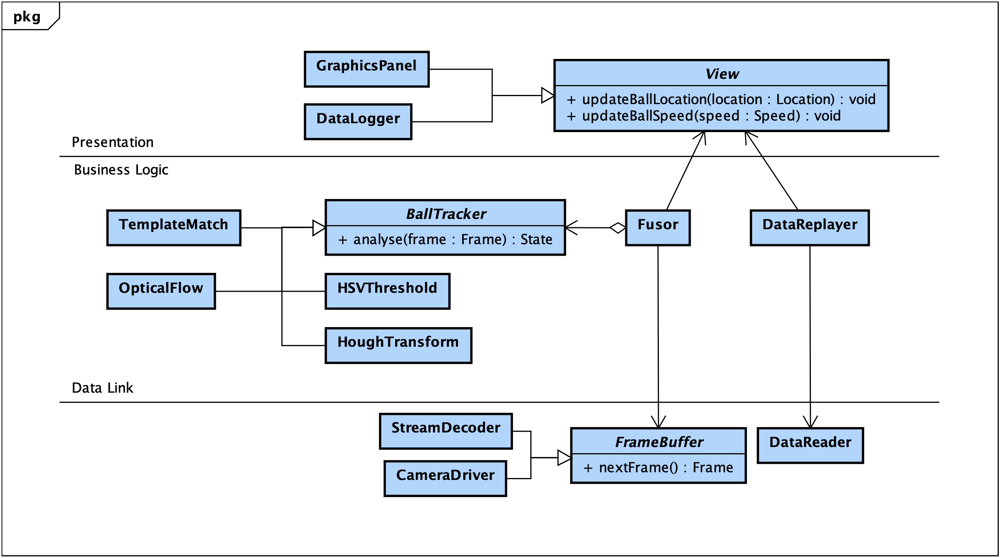
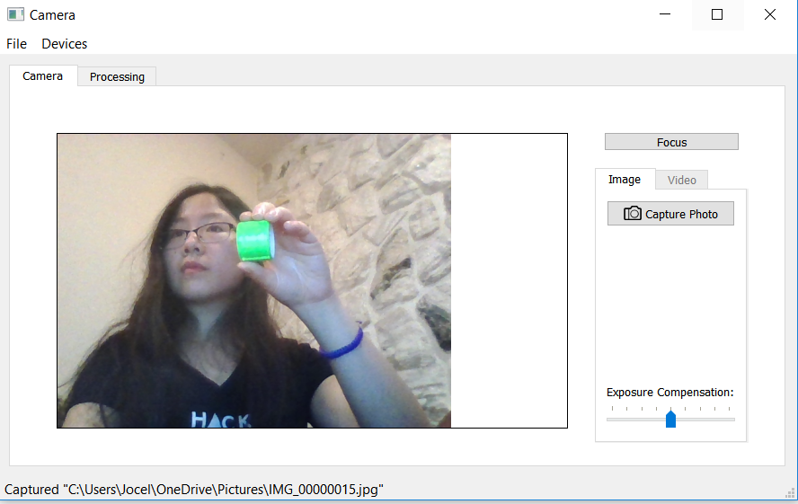
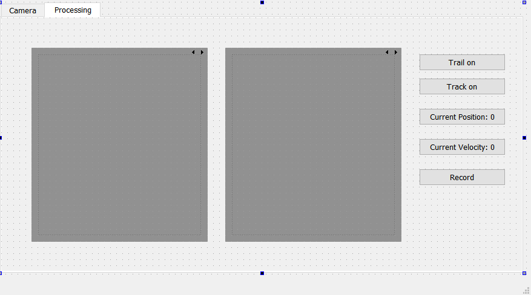
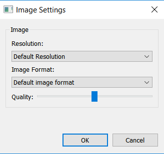
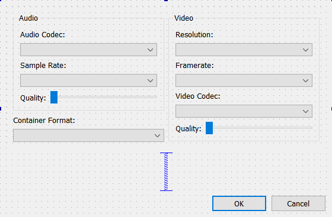
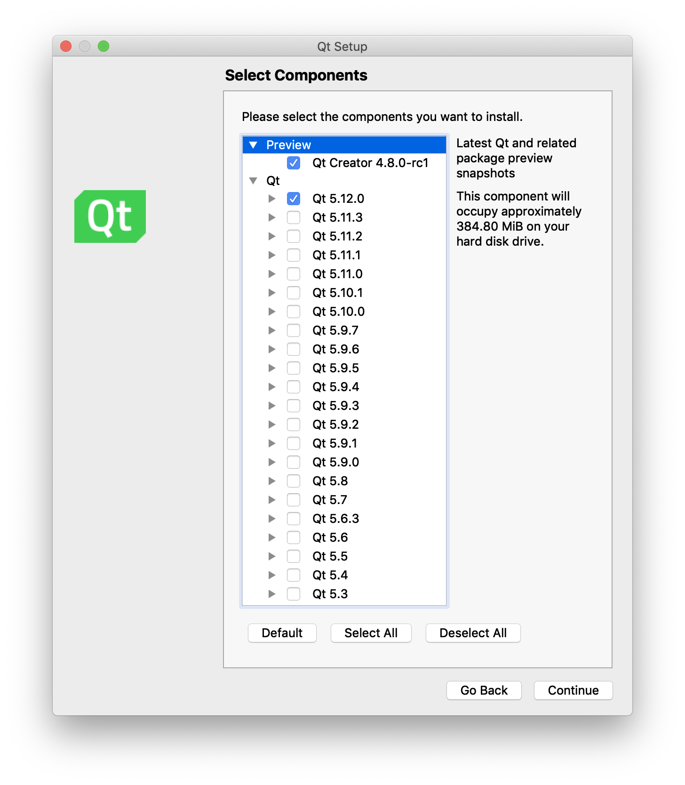

# Ball Tracker - Group GPU-B

     
<strong>Scientific Programming in C++ ENGN-2912B Section 01</strong>

     
     
<strong>Brown University   School of Engineering</strong>

     
<strong>December 2018</strong>

## Team Members
[Ziwei Chen](mailto:ziwei_chen1@brown.edu): Product owner, Scrum master 
[Jocelyn Cheng](mailto:jocelyn_cheng@brown.edu): Senior director of UX and screen design 
[Haoze Zhang](mailto:haoze_zhang@brown.edu): Senior director of software engineering 

## Introduction
### Overview
The conventional object tracking in sports is expensive and requires a highly sophisticated technique for operation. This repository presents a solution for single camera based ball tracking at low cost and with a smooth learning curve. The software consists a Graphical User Interface (GUI) implemented by using Qt for easy operation, a buffer that developed by using C++ standard templet library (STL) as well as OpenCV to ensures the real-time performance,
and an algorithm that utilizes OpenCL, OpenCV, and OpenMP for accurate tracking.

### Goals and Objectives
The goal for this project was to develop a platform that performs ball tracking in realtime at low hardware cost. Utilizing the computational power for GPU was set at one of the objects for this project, and it ensures the templet matching
can be performed in a highly efficient manner. Besides, this software platform also requires to be run in real-time to give the user instantaneous feedback for ball speed and trajectory. Aside from the performance part, this software
should also be designed to be easy to use, which means instead of a design by engineer and use by engineer software, it has to be, and the general public should be able to use the platform without any technical training.

## Software Architecture Design
### Required External Libraries
This software requires the suport of external libraries and specific environment for compiling and running. Although the use case may very, the recommended requirement list is shown as follow:

Windows 10 Pro  64bit 
Qt Creator 4.8.0 
Qt 5.12.0 
MinGW 7.3.0 64bit for C++ 
OpenCV 3.4.4 
OpenCL 2.2 
OpenMP 4.5 

### UML Diagrams
The UML Class Diagram for this program is shown as follow:  

## Interface Descriptions
### Graphical Interface and Data Visualization

The user can use the buttons on the first page to capture video and pictures, which are stored in a user-selected folder. Once captured, the video can then be processed by the algorithm. The main UI for the app is shown below:
    

Analysis on the video and data visualization is accessed via the second tab:
    
 
 Settings for the application are shown below.
    
    

### Threading and Concurrency
The software uses [OpenMP](https://www.openmp.org/) multi-threading library to take advantage of a multi-core CPU. In the main program, the workload of processing each frame is distributed to multiple threads. First, a batch of multiple images is extracted from the buffer. The number of images in a batch should be a multiple of the number of CPU cores so that the work distribution can be as even as possible. The batch should also be limited in size since batch process causes delay. Then, with the help of OpenMP, worker threads start to process the batch in parallel, one frame per thread at a time. The result is then processed in a sequential execution.

Moreover, OpenCV library uses OpenCL for parallel matrix operations. Invoking OpenCV functions implicitly involves multi-threading.

### Exception Handling
Exceptions are correctly handled in the software. Since there is not much user interaction, the software does not have intensive sanity checks to deal with user input. Typical exceptions come from hardware and concurrency issues. An exception is thrown when the buffer cannot read a valid frame from the camera, when the tracking algorithm detects an empty or nonprocessable frame, and when the GUI cannot be updated appropriately. These exceptions are caught in the main program and prompted in the console standard error output. No special operations are required in the exception handler since the software acquires real-time data, problems with any frame do not influence future performance and can be safely ignored.

## Testing and Evaluation
### Test Environment
The testing environment was set to using the recommended environment and libraries, which means using Windows 10 64bit, and Qt 4.8.0 as IDE. The actual Qt version needs to be installed was 5.12.0, and MinGW 7.3.0 64bit for C++ as the compiler.

All the libraries including OpenCV 4.3.3, OpenCL 2.1, and OpenMP 4.5 need to be configured in Windows system variables first, and then properly linked to project in Qt IDE.

### Description of Function Testing
To achieve the optimal balance between development and testing, functions tests are performed on each component instead of constructing an automated testing infrastructure. There are three functional test cases designed respectively for the GUI, tracking algorithm, and camera driver. Each test case is a single translation unit that only depends on the software component it is meant to test. The test case can be linked and generate an executable. Running the test executable can determine the correctness of the software behavior.

### Instructions for Compiling and Running
<b>Step 1:</b> Since this project was built and compiled in [Qt Creator IDE](https://www.qt.io), the required components is shown as follow: 
  

<b>Step 2:</b> Install all required libraries and packages, the download links are given as follow: 
[OpenCV 4.3.3](https://opencv.org) 
[OpenCL 2.2](https://www.khronos.org/opencl/) 
[OpenMP 4.5](https://www.openmp.org) 

<b>Step 3:</b> Configure all installed libraries and packages in Windows system variables.

<b>Step 4:</b> Configure Qt Creator IDE for using MinGW 7.3.0 64 bit for C++ as the C++ compiler, and link the libraries required to project

<b>Step 5:</b> Compile and run the software. Make sure a camera was attached via the Universal Serial Bus (USB) connection.

## Conclusions
### Major Accomplishments
For this project, the Graphical User Interface was successfully designed by using Qt. A high-speed FIFO buffer was designed by using standard templet library, and video capture and playback function were developed by using OpenCV.

Besides, A tracking algorithm was developed, and the program was designed for utilizing multithreading to maximize performance. Aside from functional accomplishments, the program also consists of error handling, which gives it the
the best stability possible.

### Results of Development Effort
The result of the development consists of the software design documents, software source code, test cases, test cases executables, and the software executables.

Most of the development objectives were achieved. The program is utilizing the computational power of GPU for algorithm acceleration, and the graphical user interface is usable. The actual tracking performance, nevertheless, is limited.

The tracking object needs to be traveling at a minimum speed for the program to follow. This was resulted by the low frame rate and low sensitivity of the camera, and cannot be resolved by software. The time consuming for the implementation of individual functions were well within expectation. The system integration, however, took most time of this project. Since the development environment was not unified, switching between different operating systems caused software incompatibility issues, and a considerable amount of time was devoted to solving them.

## Future Work
### Potential future software expansions and software features
Although this platform satisfies most development goals, improvements and feature expansions are still possible for future work. Firstly, although the operation for this platform was smooth, it still utilizes external dynamically linked libraries, which would be linked in runtime. This limits the usage and downgrade the software compatibility, and maybe a potential improvement. In addition, the tracking only works under a bright lighting condition or slow ball movement. This problem was due to the low sensibility and low frame rate for the hardware camera module. This problem can be improved by switching to a high-speed camera that outputs at least 120 frames per second.

## Author Contributions
### Ziwei Chen
Ziwei Chen was responsible for hardware camera setup, and video stream buffering. He implemented the hardware driver for this software, and buffer the captured video stream for ensuring real-time processing can be achieved. He also implemented the interface between driver and algorithm, which allows the algorithm to control the buffer status. He was also responsible for holding regular team meetings and set up meeting agendas to push the development forward.
### Jocelyn Cheng
Jocelyn Cheng was responsible for graphical user interface development and design. The UI/UX design was essential for easy user interaction,  and it was implemented by using Qt IDE. In addition, she also implemented the interface between algorithm and GUI, which made it possible for the user to visualize the real-time performance on screen.
### Haoze Zhang
He was responsible for designing the software architecture and tracking algorithms. He implemented the main program using multi-threading and integrated all software components.
